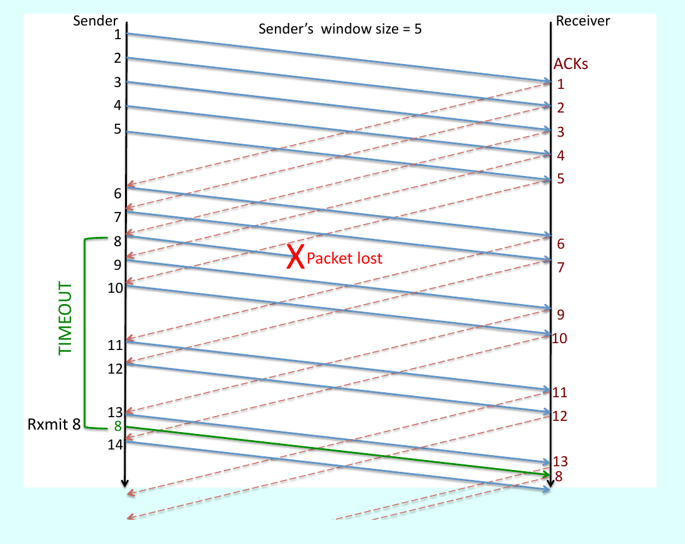
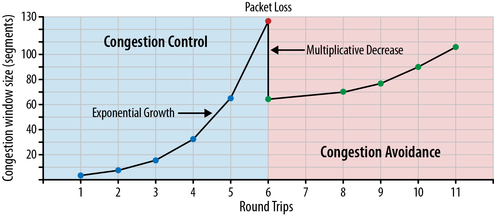
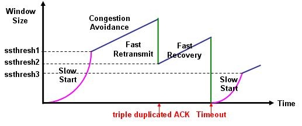
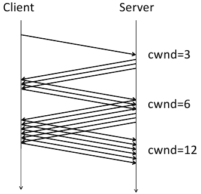
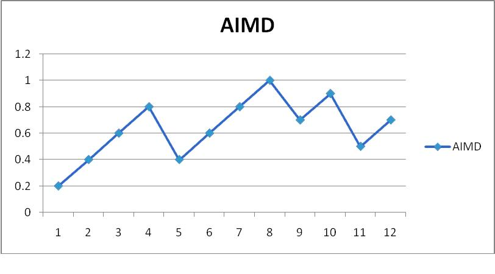

# Lecture 10: Reliable Transport & Congestion Control.
### Monday March 13, 2017
-------------------------------------
### Internet of Problems
- Connect => IP [X]
- Route => BGP [X]
- Transport :: Today

### TLAs and other abbrev.
- **RTT**: Round Trip Time
- **BGP**: Border Gateway Protocol
- **TCP**: Transport Control Protocol
- **ACK**: Acknowledgment
- **cwnd**: congestion window size

- **AQM**: Active Queue Management
- **ECN**: Explicit Congestion Notification

### Motivation: Transport Problems:
1. IP has no guarantees.
2. BGP hides network topology.
- Reliability
    - How do we cope with dropped packets
    - How do we deal with packets getting re-ordered
- Congestion
    - How do we throttle traffic to control congestion

-----------------
##### Model:
(SendingApp) ====> (ReceivingApp)
- In application layer

**TCP uses a 3-way Handshake** to initialize a connection.
client    |     server
SYN      -->
        <--    SYN,ACK
ACK      -->

(at this point, the connection is established)

(when client sends some data)
data     -->   
        <--    ACK

(when server sends some data)
        <--    data
ACK      -->
...and so on...

----------------------
### Fixing Problems
BADTHINGS
- Packets get lost
- an ACK is just a packet, which can also get dropped.      

=> Naive approach: **Stop and Wait Protocol**: The sender sends 1 packet of data, then waits for an Acknowledgment (ACK) from the receiver to send the next packet.
==> Very slow, only 1 packet per RTT, timeouts for dropped packets. 1 outstanding (un-ack'd) packet per RTT.   

=================================      
The solution: Sliding-window   
=================================    

=> Better Approach: **Sliding-window Protocol**:
- Sender creates a _Window_ of some length, say W=5. This means the connection allows for W outstanding /un-ack'd packets.
- When the Receiver gets a packet, it sends back an ACK saying that it has received packed x and all packets prior. X may not be the packet sent. The receiver sends an ACK for **each and every** packet it receives.   

=> What is the best window size, W?
- too small => Underutilized Network
- too large => Congestion

### TCP Congestion Control and Avoidance:

##### Congestion Control: Slow Start
TCP Slow Start is part of the TCP Congestion Control Strategy

TCP slow start is used to avoid sending more data than the network can handle.
- Begins with init window size = 1,2 or 10.
- The window is increased by 1 with each ack received. (effectively, this is doubling the window size in each RTT => causing a curve at the beginning)
-

##### Congestion Avoidance: AIMD
AIMD is a feedback algorithm for **TCP Congestion Avoidance.**     
Every RTT (RoundTripTime) the sender calculates:
- if no loss:
    - W+=1
- else: //congestion
    - w= w/2
- ==> **Additive increase, multiplicative increase**

Causes a "saw-tooth" pattern:

There is never a point where you fix on a window size, and stay static.   

Intuition: Very conservative, general model.    

##### Optimization: Fast Retransmit
Normally, If a sender fails to receive an ack in a specified amount of time, it assumes the packet was dropped. In this case, it must wait the whole RTT.

Fast Retransmit uses _Duplicate Acknowledgment_. When a middle-window packet is dropped, the receiver will send multiple acks to the sender with the same number packet as last received in order. This is a dumplicate ack.

Usually after 3 duplicates for a packet, x, the sender will re-send packet x+1 before waiting for the timeout.

##### Optimization: Fast Recovery
After a fast recovery, the window size should reset from one, and undergo slow-start again. This is _slow_. To allieviate this,

**Fast Recovery** prevents slow-start from happening after initialization. Rather than restart from zero, restart from half the window size, and skip the slow-start phase.

--------------------------
### Analysis.
##### Objectives/ Key Ideas:
1. Efficiency:
    - minimize drops+delay+
2. Fairness

-------------------------------
## Reading Notes:
**Best Effort** Networks have a lot of problems.
- Packets get dropped
- Packets get re-ordered
- Packets get duplicated
- ACKs also have these problems

Key Ideas:
- Redundancy to cope with packet loss => Retransmission
- Receiver buffering to cope with reordering
- Model: (sender)==>(receiver)
