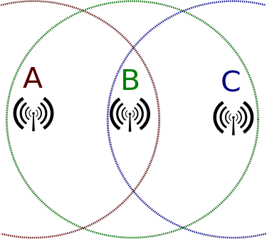

# Lecture 13: Wireless networks
## Wed Mar 22, 2017
#### MAC protocols, BitRate, internet interactions
----------------------------
We have covered
- Routing, addressing, transport
- Adapting with P2P and CDNs
- Applications like File sharing and VoIP

### Wired Networks
- 2 nodes in a network can communicate if there is a link (cable) between them.
- Only the endpoints 'hear' the information
- Have dual wires which can transmit both directions concurrently.

### Wireless Communications
General Wireless Networks
-  _Broadcast_ medium. Nodes overhear eachother
- Clients communicate to WAPs (wireless access points)
- All nodes share WAPs
- Current standard is IEEE **802.11**    

**Problem**
- if 2+ nodes send at once, their packets "collide".

#### TDMA : Time Division Multiple Access
- N Clients, time divided into n slots
- Iterate in round-robin fashion on timesharing
**CON**
- If you get to your slot, and you have nothing to send, it wastes time. ==> TDMA does not perform well under skewed/uneven load

#### CSMA : Carrier Sense Multiple Access
- Each Node keeps a probability, P_i,
- Nodes send with probability P_i
- If node is successful, p_i = min(2p_i, p_max)
- If fail: p_i = max(p_1/2, p_min)

=> Adjust by what is present. Similar to TCP.

#### Hidden Terminal Problem
<<[Wikipedia  Article](https://en.wikipedia.org/wiki/Hidden_node_problem)>>     
     

Station A can communicate with Station B. Station C can also communicate with Station B. However, Stations A and C cannot communicate with each other since they cannot sense each other on the network, because they are out of range of each other.

#### RTS/CTS :
Protocol for client/server model in wireless.    
- Clients make a request to send (RTS)
- clients send when they get a 'clear to send' (CTS)
- clients that overhear CTS messages for other clients **dont** send.

#### Interference / Noise
- Wireless Conditions can change rapidly.
    - Influenced by the surrounding environment.
    - Delay/RTT varies a lot
- The 'digital' aspects can break down a bit.
    - Need to use more robust encodings. Add **redundancy**
    - 010 => 000111000
- (802.11) lets you change your encoding on the fly.
    - 802.11 has variable bit-rate.

#### More Problems:
1. Delay/RTT varies in wireless a lot more than wired.
2. "Self Interference"
    - acks come back quickly, and the returning acks can collide with your sending of data.
3. Loss != Congestion
4. Mobility.
    - If you walk down the hall, and change WAP, you will be assigned a new IP, and must re-initiate TCP connections.
    - Keeping the same address is really hard.

> "I dont know how you all aren't amazed by your phones everyday. It just, shouldn't work, but it does. Idk. Its just amazing." -Katrina LaCurts

#### CDMA : Code Division Multiple Access
- First major mobile phone wireless protocol
- uses multi-plexing => sending multiple signals on the same channel.
