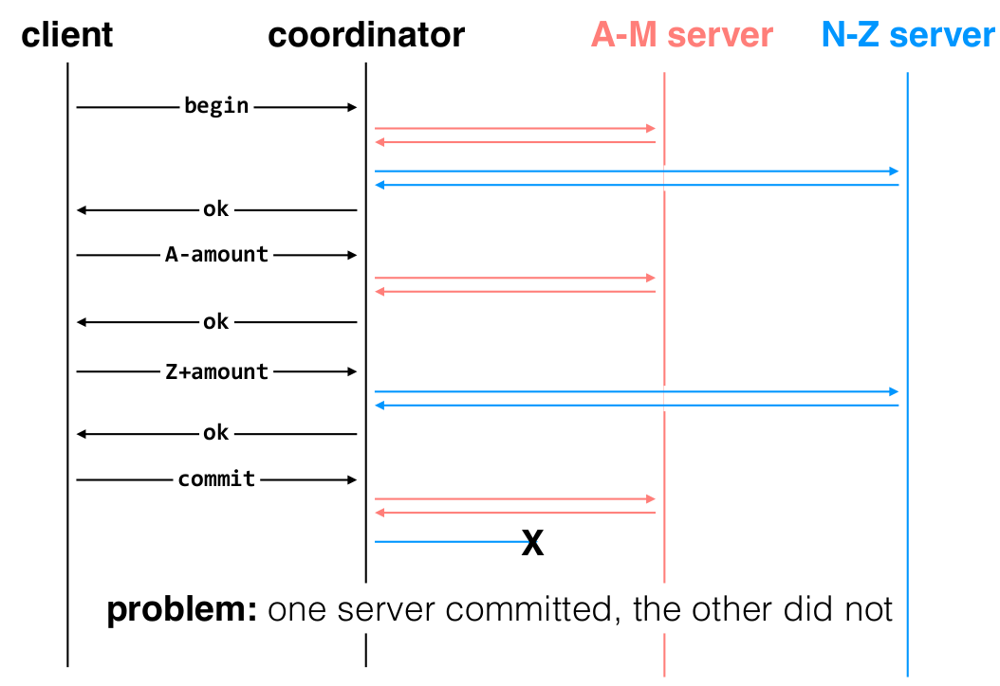
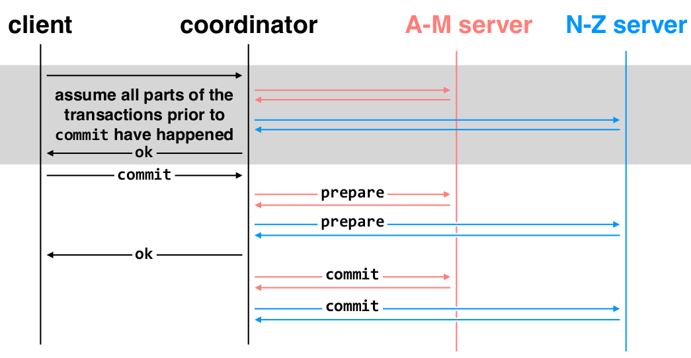

# Lecture 18: Distributed Transactions
### Apr 19, 2017

--------------------------------------------------------------------------------

### Distributed Transactions
- We begin by assuming we have Single-machine Atomicity.

- PROBLEM: One server committed, the other did not
- GOAL: Develop a protocol that can provide **Multi-site atomicity** in the face of all sorts of failures.
- SOLUTION: **Two-phase commit**.

### Two Phase Commit (2PC)
- NOTE: Very different from 2 phase locking (2Pl). Do not confuse.
- NOTE: Deadlocks are still possible in 2PC.

1. Prepare Phase
2. Commit Phase

- In two-phase commit, nodes agree that they're ready to commit before committing.
    1. all actions prior to commit have happened
    2. commit begins
    3. `prepare` messages are sent to each worker machine. (Prepared = tentatively committed. "Prepared" means that the workers will definitely commit even if they crash.)
    4. an `ack` comes back from the machines  
    5. `commit` messages are sent to the workers.

### Failures before Commit Point:
- __NOTE__: You can always abort on _failures prior to the commit point_!
- If a lost `prepare` (timeout) ==> then coordinator resends requests.
- If persistent network loss, it is assumed that worker is dead.
- If worker failure during prepare
    - coordinator can just abort the transaction
- The commit point occurs when all machines are ack'd the `prepare`.

### Failures after Commit Point:
- (`commit` messages being sent out to workers)
- if a worker dies after it has ack'd the `prepare`, the `commit` will timeout.
    - lost `commit` or lost ack can cause this. (network failures)
    - machines could fail (machine failures)
- If a machine has died _after_ the commit point, we cannot abort the transaction. Workers must be able to recover into a prepared state.
    - When worker recovers, it should notice that it received a `commit` but did not send an ack. It then asks the coordinator about the status of the transaction.
    - `prepare` records let the machine recover into "prepared" state, recovery process will finish up any prepared transactions.

### Failures of the Coordinator
- If the coordinator fails before the commit point: ABORT
- if it fails during commit:
    - Replicate the data. (go against single-copy consistency)
        - BUT: how will we keep multiple copies of data consistent? What kind of consistency?

### Performance Issues
- Coordinator can forget state of a transaction after it is DONE (minus having the records in its logs, of course).
- Workers cannot forget the state of a transaction until after they hear commit/abort from coordinator.
- 2PC can be impractical. Sometimes we use compensating actions instead (e.g., banks let you cancel a transaction for free if you do so within X minutes of initiating the transaction).

### 2PC Summary
- 2PC provides a way for a set of distributed nodes to reach agreement (commit or abort).
    - __multi-site atomicity__
- Does NOT guarantee that they agree at the same instant, nor that they even agree within bounded time.
    - This is an instance Two-Generals Paradox
- Failures _prior to the commit point_ can be aborted. If workers (or the coordinator) fail after the commit point, they recover into the prepared state, and complete the transaction.
- Remaining issues deal with availability/replication/consistency

##### The Two Generals Problem
- [Wikipedia Link](https://en.wikipedia.org/wiki/Two_Generals%27_Problem)
- Typically presented as a thought experiment for TCP
- First Computer Communication problem to be proven unsolvable.

| Army 1  |            |  Army 2 |     
|         | Enemy Base |         |

- 2 allied armies are outside of an enemy base, both ready to attack.
- Both must attack at the exact same time
- they must send messengers on foot
- Can never reach 100% consensus as there would be an infinite chain of acks.
- neither general can be 100% sure the other has received the ack

--------------------------------------------------------------------------------
--------------------------------------------------------------------------------

### 6.033: Fault Tolerance: Multi-site Atomicity
#### Lecture 18
##### Katrina LaCurts, lacurts@mit.edu

0. Introduction
 - Past two weeks: transactions (atomicity + isolation) on a single
 machine
 - Today: distributed transactions
1. The Setup + The Problem
 - Client + coordinator + two servers: one with accounts A-M, the
 other with accounts N-Z.
 - Coordinator + servers all have logs
 - Coordinator passes messages from the client to the appropriate
 servers (see slides); responses from servers/coordinator indicate
 whether the action completed successfully, or whether we need to
 abort.
 - New problems to deal with, besides server failure: network
 loss/reordering, coordinator failure
 - The main problem, though: multiple servers can experience
 different events.
 - One commits while the other crashes, one commits while the
 other aborts, etc.
2. Dealing with the Network
 - Message loss re-ordering is easy: reliable transport
 - If messages are lost, they're retransmitted
 - If duplicates are received, they're ignored
 - If messages arrive out of order, they can be put back in order
 - This is the exactly-once semantics we discussed in the very first
 day of class, with RPCs!
3. Basic Two-phase Commit (2PC)
 - Two-phase commit is the protocol that will help us here
 - Basic protocol:
 1. Coordinator sends tasks to servers (workers)
 2. Once all tasks are done, coordinator sends prepare messages to
 workers. Prepared = tentatively committed. "Prepared" means
 that the workers will definitely commit even if they crash.
 3. Once all workers are confirmed to be prepared, coordinator
 will tell them to commit, and tell client that the transaction
 has committed.
 - Two phases: prepare phase, commit phase
4. Worker/Network Failures Prior to the Commit Point
 - Basic idea: it’s okay to abort
 - Lost prepare message: coordinator times out and resends
 - If prepare message experience persistent loss, coordinator will
 consider this worker to have failed.
 - If prepare messages make it to some workers but not others,
 coordinator continues resending to "missing" workers until
 either everyone is prepared, or it has deemed some workers to
 have failed.
 - Lost ACK for prepare: coordinator times out and resends.
 Reliable transport means that workers won't repeat the action;
 they'll just ACK the duplicate.
 - Worker failure before prepare: coordinator sends abort messages
 to all workers and the client, and writes and ABORT record on its
 log.
 - Upon recovery, the worker will find that this transaction has
 aborted; see worker failure recovery in next part
5. Worker/Network Failures After the Commit Point
 - Basic idea: it’s *not* okay to abort
 - Lost commit message: coordinator times out and resends. Worker
 will also send a request for the status of this particular
 transaction.
 - For this specific failure, that request is not needed, but just
 wait.
 - Lost ACK for commit message: coordinator times out and resends
 - Worker failure before receiving commit: can't abort now!
 - After receive prepare messages, workers write PREPARE records
 into their log.
 - On recovery, they scan the log to determine what transactions
 are prepared but not yet committed or aborted.
 - They then make a request to the server asking for the status of
 that transaction. In this case, it has committed, so the
 server will send back a commit message.
 - This request is the same as the one above, after the commit
 message was lost. Whenever the worker has a prepared but not
 committed/aborted transaction, it makes periodic requests to
 the server for its status. This takes care of the case where
 a worker has not crashed, but there is persistent network
 loss such that the coordinator has determined it to have
 crashed.
 - Coordinator typically keeps a table mapping transaction ID to
 its state, for quick lookup here.
 - Worker failure after commit received: no problem; transaction is
 committed. Duplicate commits may be received after recovery, but
 that's fine (hooray for reliable transport).
6. Coordinator Failures
 - Basic idea: if before the commit point, can abort. If not, can’t!
 - Once coordinator has heard that all workers are prepared, it
 writes COMMIT to its own log. This is the commit point.
 - Once coordinator has heard that all workers are committed, it
 writes a DONE record to its own log. At that point, transaction
 is totally done.
 - Coordinator failure before prepare: on recovery, abort (send
 abort message to workers + client)
 - Why not try to continue on with the transaction? Likely the
 client has also timed out and assumed abort. Aborting
 everywhere is much cleaner.
 - Coordinator failure after commit point, but before DONE: on
 recovery, resend commits. Duplicate commit messages to some
 workers are no problem.
 - Coordinator failure after writing DONE: transaction is complete;
 nothing to do.
 - DONE record keeps coordinator from resending commit messages for
 every commit message ever upon recovery.
7. Performance Issues
 - Coordinator can forget state of a transaction after it is DONE
 (minus having the records in its logs, of course).
 - Workers cannot forget the state of a transaction until after they
 hear commit/abort from coordinator.
 - 2PC can be impractical. Sometimes we use compensating actions
 instead (e.g., banks let you cancel a transaction for free if you
 do so within X minutes of initiating the transaction).
8. 2PC Summary
 - 2PC provides a way for a set of distributed nodes to reach
 agreement (commit or abort).
 - Does NOT guarantee that they agree at the same instant, nor that
 they even agree within bounded time.
 - This is an instance Two-Generals Paradox
9. A Remaining Problem
 - When the coordinator is down in our system, the whole thing is
 inaccessible. When a worker is down, part of our data is
 unavailable.
 - Solution is replication. But how do we keep data consistent?
 - Ideal property: single-copy consistency
 - Property of the externally-visible behavior of a replicated
 system
 - Operations appear to execute as if there's only a single copy
 of the data
 - We will see a way to provide single-copy consistency on Wednesday
 - Tomorrow in recitation: PNUTS, which uses a more relaxed version
 of consistency
 - Why relax your constraints? Single-copy consistency will add a
 lot of overhead. If applications don't need it, they can often
 get better performance by relaxing their semantics.
 - Another system that does not use single-copy consistency: DNS
