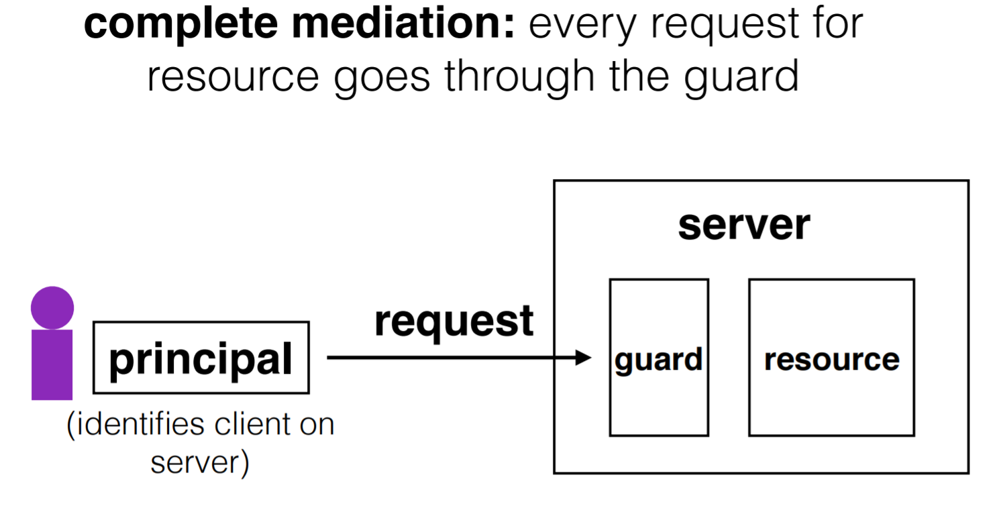

# Lecture 21: Authentication
### Mon May 1, 2017
Passwords and Authentication

--------------------------------------------------------------------------------

Remember:
- Defense against arbitrary adversary is extremely difficult
- => Need to use _Threat Models_
- Guard Model

Guard Provides:
- Authentication
- Authorization

### Passwords
- Store passwords as hashes, not the actual password (duh)  
    - plaintext passwords is a bad idea
- Store: |username|salt|H(password | salt)|
    - adversary would need a rainbow table for every possible salt
- Sending passwords a lot of the network is a liability
    - Use Cookies
- Phishing: more effective than hacking with math
    - Use a fake server
- Challenge Response Protocol:
    - Salt and hash on the client side, send the salted hash through the network.
    - Phishing servers gain nothing, just a salted hash.
- Password Bootstrapping:
    - Don't use recovery questions: Just set random strings
- Password Managers:
- 2FA => Two Factor Authentication
- Biometrics: Fingerprints, etc.
    - can you reset or be anonymous? no...

- Human Factors cause many many many problems with security.

### Hash Functions
- Not Many hash functions.
    - SHA1 / SHA256
    - MD5
- Hash functions are deterministic
    - If x_1 == x_2 then H(x_1) == H(x_2)
- Hash Functions are 1 directional.
    - Given x, we can always compute H(x)  (not always fast)
    - Given H(x), it is virtually impossible to find x
    - If x_1 != x_2, it is almost certain that H(x_1) != H(x_2) (collision resistant)
        - Some hash collisions do occur though.

### Salted Hash
- Store username, "salt" (a random number), and the hash of the password concatenated with the salt
    - Adversary *will* see the salt if they get this table, but to build a rainbow table, they'd have to calculate the salt of every common password concatenated with every possible salt. It's impractical to build that table.
    - They could build a rainbow table for a particular user (i.e.,for a particular salt value). If they're targeting one  specific user, this might be worth it, but often isn't.
    - The goal of many attacks is to get as many accounts as possible
    - The nice thing about rainbow tables is that you can build them once and use them forever (they do take *some* time to create). One per user per salt is much more onerous.

#### Session Cookies
- cookie = {username, expiration, H(serverkey | username | expiration)}
    - no need to store password
    - serverkey ensures users can't make cookies, only server
    - server can change keys, invalidate old cookies
    - user can't change expiration of cookie, only can log out and trigger server to terminate.

### Phishing
-  Phishing attacks: Adversary tricks users into visiting a legitimate-looking site

- Challenge Response Protocol

- Flipped Challenge Response Protocol

### Other Auth Methods
- Password Managers
- Two-step verification (2FA)
    - Server texts you a code that you have to input (along with your password) when you log in
    - Pros: Adversaries need your password and your phone to mount attack
    - Cons: Inconvenient, slow
- Biometrics
    - E.g., retina scans, fingerprints
    - Pros: Adversaries have to be you (or near you) to log in
    - Cons: Can you reset the “password”? Also hard to be anonymous
- Passwords aren’t perfect. Many alternatives are more secure in some senses. But all have trade-offs for complexity, convenience

--------------------------------------------------------------------------------
--------------------------------------------------------------------------------

### 6.033: Security - Principal Authentication
#### Lecture 21
##### Katrina LaCurts, lacurts@mit.edu

**********************************************************************
* Disclaimer: This is part of the security section in 6.033. Only *
* use the information you learn in this portion of the class to *
* secure your own systems, not to attack others. *
**********************************************************************
0. Introduction
 - Current security guidelines
 - Be explicit about our policy and threat model
 - Use the guard model to provide complete mediation
 - Make as few components trusted as possible
 - Guard (in guard model) commonly provides authentication and
 authorization
 - Commonly, but not always; some systems let users be anonymous
 - Today: principal authentication, primarily via passwords
 - Later, we'll discuss principal authentication via something
 other than passwords
 - We are also not dealing with message authentication today;
 we'll get to that in a later lecture.
1. Authentication via Passwords
 - Goal of authentication: Verify that the user is who they say they
 are. An attacker should *not* be able to impersonate the user.
 - Why passwords?
 - In theory, lots of options: A random 8-letter password => 26^8
 possibilities (more like 60^8 if you allow
 lowercase/caps/numbers/symbols). n-letter passwords even
 better.
 - Guessing is expensive; brute-force attack is infeasible
2. Implementing Passwords
 - Scenario: logging into an account on a shared computer system
 - Threat model: attacker has some access to the server on which
 password information is stored
 - Attacker does *not* have access to the network between client
 and server; that comes in a future lecture
 - Attempt 1: Store plaintext passwords on server. Very bad idea.
 - If adversary has access to the server (example: they are a
 sysadmin), they can just read passwords straight from the
 accounts table.
 - If adversary has access to server but not table, they could
 use buffer overflow.
 - Lesson: don't store secure information in plaintext
 - Attempt 2: Store hashes of passwords on the server
 - A hash function H takes an input string of arbitrary size and
 outputs a fixed-length string.
 - If two input strings, x and y, are different, the probability
 that H(x) = H(y) is virtually zero (hash functions are
 "collision resistant").
 - Cryptographic hash functions are one-way: Given H(x), it's
 (very) hard to recover x.
 - If adversary gets access to table, they just have hashes, not
 passwords.
 - But.. can compare that to hashes of popular passwords
 - Rainbow table: map common passwords (e.g., "123456") to their
 hashes.
 - Actually more complex in practice
 - With a rainbow table, adversary can figure out who has one of
 the most common passwords, which is a lot of people.
 - Hash functions that are fast to compute make this data
 structure very easy to create. “Slow hashes” (key-derivation
 functions) take longer, but it’s still possible to create
 rainbow tables of the most common passwords.
 - Lesson: think about human factors when designing secure systems
 - Attempt 3: Salt the hashes
 - Store username, "salt" (a random number), and the hash of the
 password concatenated with the salt)
 - Adversary *will* see the salt if they get this table, but to
 build a rainbow table, they'd have to calculate the salt of
 every common password concatenated with every possible salt.
 It's impractical to build that table.
 - They could build a rainbow table for a particular user (i.e.,
 for a particular salt value). If they're targeting one
 specific user, this might be worth it, but often isn't.
 - The goal of many attacks is to get as many accounts as
 possible
 - The nice thing about rainbow tables is that you can build
 them once and use them forever (they do take *some* time to
 create). One per user per salt is much more onerous.
3. Session Cookies
 - Typically we use passwords to bootstrap authentication, but don't
 continuously authenticate with our password for every command
 - Security: Typing, storing, transmitting, checking password is a
 risk.
 - Convenience (sometimes). No one wants to type their password
for
 every command. We could try to automate this process, but that
 means we have to store our password somewhere, and you've seen
 where that got us.
 - Web apps often exchange passwords for session cookies: like
 temporary passwords that are good for a limited time.
 - Basic idea: client sends username/password to server. If it
checks
 out, server sends back a cookie:
 cookie = {username, expiration, H(serverkey | username |
expiration)}
 Client uses this tuple to authenticate itself for some period of
 time.
 - No need to store password in (client) memory or re-enter it
 - Why use serverkey in hash?
 - Ensure that users can't fabricate the hash themselves
 - Server can change serverkey, invalidate old cookies
 - Can user change expiration?
 - No. To do that, they'd also have to change the hash, which they
 can't do (they don't know serverkey)
4. Phishing
 - Phishing attacks: Adversary tricks users into visiting a
 legitimate-looking site (that adversary owns), asks for
 username/password
 - Has nothing to do with whether the network is secure: we just
 handed the password to the adversary
 - Solution 1: Challenge-response protocol
 - Assume (for now) the server stores plaintext passwords
 - Instead of asking for the password, the server chooses a
 random value r, sends it to the client.
 - Client computes H(r + password), sends that back to the
 server
 - Server checks whether this matches its computation of the
 hash with the expected password
 - If the server didn't already know the password, it still
 doesn't.
 - If server stores (salted) hashes, we could have the client
 compute H(r | H(p)) (or H(r | H(s | p))) and send that. But
 then H(p) is effectively the password. And by storing hashes,
 the server is storing passwords.
 - Solution: SRP ("Secure Remote Password") protocol
 - No details in 6.033, but allows server to store hashes of
 passwords and still do a challenge-response
 - Lesson: Make the server prove that it knows a secret without
 revealing that secret.
 - Another idea (not covered in lecture): Flip the challengeresponse
 protocol.
 - Put onus on server
 - Client chooses Q, sends to server
 - Server computes H(Q + password) and replies
 - Only the authentic server would know your password!
 - Rarely used in practice; app developers just care about apps
 authenticating the user
 - Complication: Combined with the original challenge-response
 protocol, can fool server
 - Suppose I'm an adversary that wants to be able to login to
 the server. S sends me a challenge r, but I don't know the
 password, so I can't compute H(r+p).
 - Instead, I'll challenge S with the *same* r, and replay its
 response. E.g.:
 Evil client S
 < ------ r -----
 -------- r -----> <- evil client issues its *own*
challenge
 <---- H(r+p) --- <- server responds to challenge
 ----- H(r+p) ---> <- evil client responds to original
 challenge
 - Lesson: Be explicit. E.g., hash the intended recipient of
 response (e.g., client or server), and have the recipient
 verify t.
5. Bootstrapping/Resetting
 - How do we initially set a password for an account? If an
 adversary can subvert this process, there's virtually nothing we
 can do.
 - MIT: admissions office vets each student, hands out account
 codes.
 - Many web sites: anyone with an email can create a new account.
 - How do we change our password, e.g., after compromise?
 - MIT: walk over to accounts office, show ID, admin can reset
 password.
 - Many web sites: additional "security" questions used to reset
 password.
 - Why does this matter?
 - Password bootstrap / reset mechanisms are part of the security
 system, important that they are not weak
 - Anecdote: Sarah Palin's Yahoo account was compromised by an
 attacker guessing her security questions. Personal information
 can be easy to find online.
 - Lesson: Don't forget the bootstrapping/resetting parts of a
 system when designing it.
6. Password Alternatives
 - Password Managers
 - Automatically generate "good" passwords for you
 - Securely keep track of your passwords, protected via one
 *really* good password (that you choose)
 - Pros: keeps users from picking bad passwords/reusing passwords
 - Cons: Less convenient, what happens if you lose the one good
 password? Do you trust the authors of the password manager?
 - Two-step verification
 - Server texts you a code that you have to input (along with your
 password) when you log in
 - Pros: Adversaries need your password and your phone to mount
 attack
 - Cons: Inconvenient, slow
 - Biometrics
 - E.g., retina scans, fingerprints
 - Pros: Adversaries have to be you (or near you) to log in
 - Cons: Can you reset the “password”? Also hard to be anonymous
 - Passwords aren’t perfect. Many alternatives are more secure in
 some senses. But all have trade-offs for complexity, convenience
