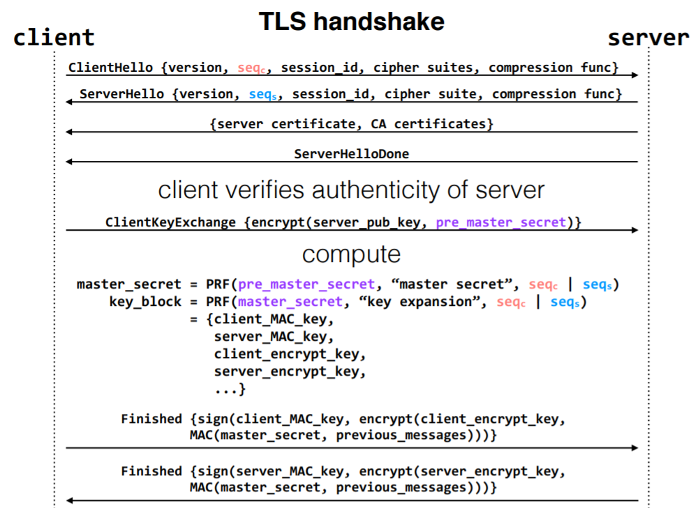
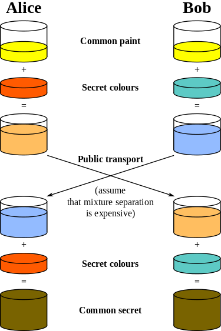

# Lecture 22: Secure Channels.
### Wed May 3, 2017

--------------------------------------------------------------------------------

### Network Security:
- Adversaries may be in the local wireless network. (not just in the server)

- Ballz game sniffed during class.
    - Someone also made in-app purchases for the game while in class.

- DHCP (dynamic host config protocol) in the router assigns devices to IPs.

- GOALS:
    1. Confidentiality (w/ Encryption)
    2. Integrity (w/ MACs)


```py
encrypt(key,message) => ciphertext
decrypt(key,ciphertext) => message
```
- Given the ciphertext, it is (virtually) impossible to obtain the message without knowing the key.
- Adversaries can not figure out the original message, but they can alter the ciphertext to decrypt to a different message.
    - This seems unlikely, but 'unlikely' is not absolute and hackers are smart.
    - ENCRYPTION DOES NOT ENSURE INTEGRITY
- MAC => Message Authentication Code :: DIFFERENT FROM MAC ADDRESS!!
    - MAC acts as a hash to check Integrity

```py
c = encrypt(k,m)
h = MAC(k,m) # returns token
#-----
m =decrypt(k,c)
MAC(k,m) == h ?
```
- Encrypt and decrypt are related mathematically.

- NEW Problem: Reflection Attack
    - adversary could intercept a message , resend it at a later time in the opposite direction.
        - Imagine a '-$1000' message going the wrong way
        - Need to use different keys in different directions
    - Using different MACs ensures integrity.

### Encryption
- This is not an algebra class.

- Problem: How do the parties know the keys?
    - Known: p (prime) , g, g^a mod p, g^b mod p

- Symmetric Encryption does not help very much in networking.
- Asymmetric Encryption is important.
    - User Generates:
        - Public Key
        - Secret Key
    - Use Cryptographic signatures

```py
sign(secret_key, message) => sig
verify(public_key, message, sig) => yes
```
- It is virtually impossible to compute sig without secret key

- Public Keys are kept with certificate authorities (usually controlled by companies or governments).

### TLS Handshake TODO (copy slide)
- Client Hello:



TLS: A protocol that does all of this
- Lots of parts to this protocol
- Interesting one: how the connection is set up:
    - Client and server agree on some parameters:
        - protocol version
        - random sequence numbers
        - cipher/compression scheme
    - Server sends client its certificate and list of CAs
    - Client verifies authenticity of server
    - Client sends secret value (the "pre_master_secret") encrypted with the server's public key
    - Client and server compute master_secret using a pseudorandom function and the pre_master_secret and two initial random sequence numbers as input
- Both compute a bunch of keys
    - Client, server MAC keys; encrypt keys; others
- Both send "finished" messages, which contain hashes of some of the previous messages
- If this were a crypto class, we'd talk a lot about why each of
these parts of necessary
- This is not a crypto class. But it is worth noting how complex
this protocol is. Complexity comes from supporting lots of
options/protocols

### Summary
- Encrypting with symmetric keys provides secrecy, and using MACs provides integrity. Diffie-Hellman key exchange lets us exchange the symmetric key securely
    - d-h Diffie-Hellman can bootstrap a secure channel, but does not auth endpoints
    - is susceptible to MitM attacks (Man in the Middle)
    - 

- To verify identities, we use public-key cryptography and cryptographic signatures. We often distribute public keys with certificate authorities, though this method is not perfect.
- Secure channels protect us from adversaries that can observer and tamper with packets in the network.

--------------------------------------------------------------------------------
--------------------------------------------------------------------------------

### 6.033: Security - Secure Channels
#### Lecture 22
##### Katrina LaCurts, lacurts@mit.edu

**********************************************************************
* Disclaimer: This is part of the security section in 6.033. Only *
* use the information you learn in this portion of the class to *
* secure your own systems, not to attack others. *
**********************************************************************
0. Today's threat model
 - Last time: adversary with access to server
 - Today: adversary in the network
 - What can adversary in the network do?
 - Observe packets
 - Corrupt packets
 - Inject packets
 - Drop packets
 - Some can be combated with techniques you already know
 - TCP senders retransmit dropped packets
 - Corrupt packets get dropped (at a router, usually), and thus
 also retransmitted
 - Need a plan, though, for carefully corrupted, injected, or
 sniffed packets
 - This lecture: focus on preventing an adversary in the network
 from observing/tampering with contents of packets
 - So NOT injecting new packets; that's next time
 - Goals (policy)
 1. Confidentiality: adversary cannot learn message contents
 2. Integrity: adversary cannot tamper with message contents
 - More accurately, if the adversary tampers with the message
 contents, the sender and/or receiver will detect it.
 - Result is known as a "secure channel"
1. Secure Channel Primitives
 - Ensure confidentiality by encryption
 - Encrypt(k, m) -> c ; Decrypt(k, c) -> m
 - k = key (secret; unknown to adversary, never transmitted)
 - m = message
 - c = ciphertext
 - Property: given c, it is (virtually) impossible to obtain m
 without knowing k
 - Encryption alone does not provide integrity
 - Adversary could change some bits in ciphertext
 - Other mathematical reasons
 - See http://security.stackexchange.com/questions/33569/
 why-do-you-need-message-authentication-in-addition-toencryption
 - Section 11.4.4 of the course textbook.
 - Ensure integrity via message authentication codes (MAC)
 - MAC(k, m) -> t
 - k = key
 - m = message
 - t = output
 - Similar to hash functions. Difference: uses a key
 - Alternate name: "keyed hash function"
 - Adversary can't compute the MAC of a message; needs key.
 (This is not true for regular hash functions)
 - There are other subtle differences we won't get into. One
 example: MACs are not always subject to the same
 mathematical requirements as cryptographic hash functions.
2. Secure Channel Abstraction
 - So far:
 Sender Receiver
 m
 c = encrypt(k, m)
 h = MAC(k, m)
 ------------------ [ c | h ] ----------> m' = decrypt(k, c)
 check MAC(k, m') == h
 - If adversary intercepts [c|h] and tampers with it, receiver will
 know; MAC won't check out.
 - Aside: Instead of [c|h], sender could send either of these:
 - c | MAC(c)
 - encrypt(k, m | MAC(k,m))
 - All provide level of integrity that we need. Different levels
 of security against other types of attacks; see http://crypto.
 stackexchange.com/questions/202/should-we-mac-then-encrypt-or-
 encrypt-then-mac if interested
 - Problem: adversary can intercept, and then retransmit message
 ("replay" message)
 - Solution: Include a sequence number in every message, and choose
 a new random sequence number for every connection
 Sender Receiver
 m
 c = encrypt(k, m | seq)
 h = MAC(k, m | seq)
 ----------- c | h --------> m' | seq' = decrypt(k, c)
 check MAC(k, m' | seq') == h
 - If adversary intercepts message, can't replay in the same way
 because sender won't reuse sequence number
 - Assume sequence numbers don't wrap around
 - Aside: In reality, if there is a conversation that is long
 enough that the sequence number space is exhausted, a session
 is "renegotiated" between the sender and the receiver. (You
 could, for instance, imagine that whenever a session is
 renegotiated, the sender and receiver both change their keys.
 In reality, they change a particular random value known as the
 session ID.
 - But if receiver is also sending to the sender (i.e., if they're
 both sending), the receiver might use that sequence number. So
 adversary could replay in the other direction (a "reflection"
 attack)
 - Solution: Use different keys in each direction
3. Key Exchange
 - How do sender/receiver get keys in the first place? Can't just
 send them in the clear in the beginning
 - Diffie-Hellman key exchange
 - Two parties: Alice and Bob ("sender" and "receiver" before)
 - Alice and Bob pick:
 - a prime number p
 - a "generator" g
 - Aside: For g to be a generator, it has to be a "primitive
 root modulo p". In 6.033, don't worry about that; we'll
 always tell you g and p. If you want to know more about
 primitive roots, take a cryptography, number theory, or
 abstract algebra class.
 - p and g don't need to be secret; assume adversary knows them
 - Alice picks random number a (secret)
 - Bob picks random number b (secret)
 - Alice sends g^a mod p to Bob
 - Bob sends g^b mod p to Alice
 - Alice computes (g^b mod p) ^ a mod p = g^ab mod p
 - Bob computes (g^a mod p) ^ b mod p = g^ab mod p
 - Secret key = g^ab mod p
 - Adversary can learn p, g, g^a mod p, g^b mod p. From this, one
 cannot calculate g^ab mod p; you need to know either a or b to
 do that.
 - Trust me on that; won't prove it in 6.033
 - Problem: Man-in-the-middle attack
 - Adversary in middle of network intercepts (and responds to)
 messages in both directions; Alice thinks she has established
 a connection with Bob, and vice versa; in reality, they've both
 established a connection with the adversary.
4. Cryptographic Signatures for Message Authentication
 - Problem with the above is that messages aren't authenticated;
 Alice doesn't know if she's really talking to Bob, and vice versa
 - Before: shared key between the two parties. Known as symmetric
 key cryptography.
 - For signatures: public-key cryptography
 - Each user generates a key pair: (PK, SK)
 - PK is public: known to everyone, adversaries included
 - SK is secret: known only to user
 - PK and SK are related mathematically; we will not get into that
 here
 - RSA is a scheme that generates a key-pair for you.
 - SK let's you sign messages; PK let's you verify signatures (but
 NOT perform the signing)
 - Primitives
 - Sign(SK, m) -> sig.
 - SK = secret key
 - m = message
 - sig = signature
 - Verify(PK, m, sig) -> yes/no.
 - PK = public key
 - m = message
 - sig = signature
 - "yes/no" -> yes if signature is verified, no otherwise
 - Notation: m_SK = {m, sig=Sign(SK, m)}. Given m_SK, and
 corresponding PK, we can check that m was signed by someone with
 SK
 - This is all similar to MACs. Signatures don't require parties
 to share a key
5. Key Distribution
 - How do we distribute public keys? Lots of ideas
 1. Alice remembers the key she used to communicate with Bob the
 last time.
 - Easy to implement, effective against subsequent
 man-in-the-middle attacks
 - Doesn't protect against MITM attacks the first time around,
 doesn't allow parties to change keys
 2. Consult some authority that knows everyone's public key
 - Doesn't scale (client asks authority for a PK for every new
 name)
 - Alice needs server's public key beforehand
 3. Authority, but pre-compute responses. Authority creates signed
 messages: {Bob, PK_bob}_{SK_as}. Anyone can verify that the
 authority signed this message, given PK_as. When Alice wants to
 talk to Bob, she needs a signed message from the authority, but
 it doesn't matter where this message comes from as long as the
 signature checks out (i.e., Alice could retrieve the message
 from a different server).
 - This signed message is a certificate
 - More scalable
 - Certificate authorities bring up questions:
 - Who should run the certificate authority?
 - How does the browser get this list of CAs?
 - Generally they come with the browser.
 - How does the CA build its table of names <-> public keys?
 - Have to agree on how to name principals, and need a mechanism
 to check that a key corresponds to a name
 - What if a CA makes a mistake?
 - Need a way to revoke certificates
 - Expiration date? Useful in long term, not for immediate
 problems
 - Publish certificate revocation list? Works in theory, not as
 well in practice (CRLs sometimes incorrect, not always
 updated immediately)
 - Aside:
 http://ssl-research.ccs.neu.edu/papers/Heartbleed-IMC.pdf
 - Query online server to check certificate freshness? Not a
 bad idea
 - Alternative: avoid CAs by using public keys as names (protocols:
 SPKI/SDSI). Works well for names that users don't have to
 remember/enter
6. TLS: A protocol that does all of this
 - Lots of parts to this protocol
 - Interesting one: how the connection is set up:
 - Client and server agree on some parameters:
 - protocol version
 - random sequence numbers
 - cipher/compression scheme
 - Server sends client its certificate and list of CAs
 - Client verifies authenticity of server
 - Client sends secret value (the "pre_master_secret")
 encrypted with the server's public key
 - Client and server compute master_secret using a pseudorandom
 function and the pre_master_secret and two initial random
 sequence numbers as input
 - Both compute a bunch of keys
 - Client, server MAC keys; encrypt keys; others
 - Both send "finished" messages, which contain hashes of some of
 the previous messages
 - If this were a crypto class, we'd talk a lot about why each of
 these parts of necessary
 - This is not a crypto class. But it is worth noting how complex
 this protocol is. Complexity comes from supporting lots of
 options/protocols
7. Discussion
 - Why isn't traffic encrypted by default?
 - Can be computationally expensive
 - Complex to implement
 - Wasn't a well-known thing for most users until relatively
 recently
 - Historically just applied to transactions that obviously need
 to be secured. E.g., banking
 - Maybe we're at a point now where these arguments no longer
 apply?
 - Open vs. Closed Design
 - Should system designers keep details of encrypt/decrypt/MAC/
 etc. a secret?
 - No: make the weakest practical assumptions about the
 adversary. Assume they known the algorithms, but not the
 secret keys.
 - Also lets us reuse well-tested, prove algorithms
 - Plus, if key is compromised, we can change it (unlike the
 algorithms)
